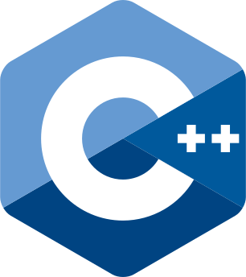

<h1 align="center">
    <picture>
        <source media="(prefers-color-scheme: dark)" srcset="./media/jamesgober-logo-dark.png">
        
    </picture>
     
    <b>JAMES GOBER</b>
     
</h1>

<!--
**jamesgober/jamesgober** is a ✨ _special_ ✨ repository because its `README.md` (this file) appears on your GitHub profile.

Here are some ideas to get you started:

- 🔭 I’m currently working on ...
- 🌱 I’m currently learning ...
- 👯 I’m looking to collaborate on ...
- 🤔 I’m looking for help with ...
- 💬 Ask me about ...
- 📫 How to reach me: ...
- 😄 Pronouns: ...
- ⚡ Fun fact: ...
-->

&nbsp;

    
    &nbsp;&nbsp;
    
    &nbsp;&nbsp;
    
    &nbsp;&nbsp;
    
    &nbsp;&nbsp;
    
    &nbsp;&nbsp;
    
    &nbsp;&nbsp;
    
    &nbsp;&nbsp;
    
    &nbsp;&nbsp;
    
    &nbsp;&nbsp;
    
    &nbsp;&nbsp;
    

&nbsp;

    <h2>BACKEND STACK</h2>
    
    &nbsp;&nbsp;&nbsp;
    
    &nbsp;&nbsp;
    

&nbsp;

    
    &nbsp;&nbsp;&nbsp;&nbsp;&nbsp;&nbsp;&nbsp;&nbsp&nbsp;
    
    &nbsp;&nbsp;&nbsp;&nbsp;&nbsp;&nbsp;&nbsp;&nbsp;&nbsp
    

&nbsp;

    <h2>FRONTEND STACK</h2>
    
    &nbsp;&nbsp;&nbsp;&nbsp;&nbsp;&nbsp;&nbsp;&nbsp;&nbsp;
    
    &nbsp;&nbsp;&nbsp;&nbsp;&nbsp;&nbsp;&nbsp;&nbsp;&nbsp;&nbsp;
    

&nbsp;

    <b>frontend development stack</b>
     
    
    
    &nbsp;&nbsp;&nbsp;&nbsp;&nbsp;&nbsp;

&nbsp;

&nbsp;

    
    &nbsp;&nbsp;&nbsp;
    
    &nbsp;&nbsp;&nbsp;
    
    &nbsp;&nbsp;&nbsp;
    
    &nbsp;&nbsp;&nbsp;
    

